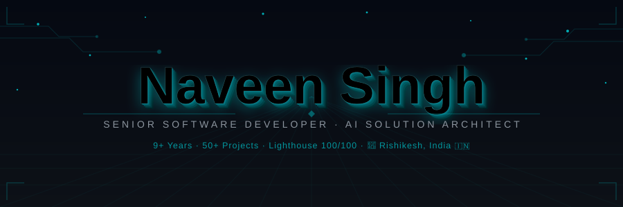

<div align="center">

[](https://github.com/naveensingh-dev)

</div>

<br/>

<div align="center">

[](https://naveen-singh-portfolio.netlify.app/)&nbsp;
[](https://linkedin.com/in/naveen-singh-dev)&nbsp;
[](mailto:naveensingh.angular@gmail.com)&nbsp;
[](https://wa.me/918077486316)&nbsp;
[](https://github.com/naveensingh-dev)

</div>

<br/>


## 👨‍💻 &nbsp;Who Am I?

```typescript
const naveen: SeniorDeveloper = {
  name:        "Naveen Singh",
  alias:       "NaveenOS v3.0",
  title:       "Senior Software Developer & AI Solution Architect",
  location:    "📍 Rishikesh, India 🇮🇳",
  experience:  "9+ years in production",
  shipped:     "50+ projects delivered",
  performance: "100/100 Lighthouse — every single deployment 🏆",

  stack: {
    frontend: ["Angular 17+", "React", "TypeScript", "RxJS", "Micro-Frontends", "NgRx"],
    ai_ml:    ["LangChain", "LangGraph", "RAG", "Prompt Engineering", "AI Agents", "Ollama"],
    backend:  ["Node.js", "GraphQL", "PostgreSQL", "MongoDB", "REST APIs", "Express"],
    devops:   ["Docker", "GitHub Actions", "Vercel", "CI/CD Pipelines", "Linux"],
  },

  currentlyBuilding: [
    "🤖 AI-powered dev agents for frontend productivity",
    "🧩 Angular 17+ fully-typed component library",
    "🧠 RAG + Vector DB for intelligent code assistance",
  ],

  contact: {
    portfolio: "https://naveen-singh-portfolio.netlify.app/",
    email:     "naveensingh.angular@gmail.com",
    phone:     "+91 8077486316",
  },

  philosophy: "Architecture first. Ship fast. Let AI amplify the human.",
  funFact:    "I debug at 2AM — but my commits always have clean messages 😄",
};
```


## 🎯 &nbsp;Core Expertise

<div align="center">

<table>
<tr>
<td align="center" valign="top" width="215">

**🏗️ Architecture**

─────────────────

Scalable Angular Apps<br/>
Micro-Frontend Design<br/>
Design Systems & UI Libs<br/>
Domain-Driven Design

</td>
<td align="center" valign="top" width="215">

**🤖 AI Engineering**

─────────────────

RAG & LLM Pipelines<br/>
AI Agent Workflows<br/>
Prompt Engineering<br/>
LangChain / LangGraph

</td>
<td align="center" valign="top" width="215">

**⚡ Performance**

─────────────────

100 Lighthouse Scores<br/>
Sub-second Load Times<br/>
Bundle Optimization<br/>
RxJS Stream Mastery

</td>
<td align="center" valign="top" width="215">

**🛠️ DevOps**

─────────────────

Docker & CI/CD<br/>
GitHub Actions<br/>
Vercel Edge Deploy<br/>
Infrastructure as Code

</td>
</tr>
</table>

</div>


## 🚀 &nbsp;Featured Projects

<div align="center">

| &nbsp; | Project | Description | Stack |
|:---:|:---|:---|:---|
| 🗺️ | [**atlas**](https://github.com/naveensingh-dev/atlas) | AI-First Architecture Platform — intelligent system design & workflow orchestration engine | `Angular` `LangGraph` `AI Agents` |
| 🧠 | [**ResearchSyndicate**](https://github.com/naveensingh-dev/ResearchSyndicate) | AI Research Aggregator — automated knowledge discovery with RAG pipelines | `Python` `LangChain` `RAG` |
| 🤖 | [**GitMind**](https://github.com/naveensingh-dev/GitMind) | AI Code Intelligence Agent — context-aware analysis & smart refactoring | `Python` `OpenAI` `Git` |
| 📈 | [**simple_stock_app**](https://github.com/naveensingh-dev/simple_stock_app) | Real-time Stock Dashboard — live data visualization with Angular & RxJS | `Angular` `RxJS` `REST` |
| 🏗️ | [**sas-platform**](https://github.com/naveensingh-dev/sas-platform) | Enterprise SaaS Architecture — multi-tenant platform with modular GraphQL design | `Angular` `GraphQL` `Node.js` |
| 🎨 | [**architect-sprint**](https://github.com/naveensingh-dev/architect-sprint) | Frontend Architecture Patterns — reusable UI components & design system | `Angular` `TypeScript` `SCSS` |

</div>


## 🛠️ &nbsp;Tech Stack

<div align="center">

### 🎨 Frontend


### ⚙️ Backend & APIs


### 🤖 AI / ML


### 🛠️ DevOps & Tools


</div>


## 📊 &nbsp;GitHub Analytics

<div align="center">


&nbsp;


<br/><br/>

[](https://github.com/naveensingh-dev)

<br/>

[](https://github.com/naveensingh-dev)

<br/>

[](https://github.com/naveensingh-dev)

</div>


## 🐍 &nbsp;Contribution Snake

<div align="center">

<picture>
  <source media="(prefers-color-scheme: dark)"  srcset="https://raw.githubusercontent.com/naveensingh-dev/naveensingh-dev/output/github-contribution-grid-snake-dark.svg"/>
  <source media="(prefers-color-scheme: light)" srcset="https://raw.githubusercontent.com/naveensingh-dev/naveensingh-dev/output/github-contribution-grid-snake.svg"/>
  
</picture>

</div>

<details>
<summary>⚙️ &nbsp;<b>One-time setup to activate snake (click to expand)</b></summary>
<br/>

Create `.github/workflows/snake.yml` in your profile repo, then run it manually once from the **Actions** tab:

```yaml
name: Generate Snake Animation
on:
  schedule:
    - cron: "0 0 * * *"
  workflow_dispatch:
jobs:
  generate:
    runs-on: ubuntu-latest
    steps:
      - uses: Platane/snk/svg-only@v3
        with:
          github_user_name: naveensingh-dev
          outputs: |
            dist/github-contribution-grid-snake.svg
            dist/github-contribution-grid-snake-dark.svg?palette=github-dark
      - uses: crazy-max/ghaction-github-pages@v3
        with:
          target_branch: output
          build_dir: dist
        env:
          GITHUB_TOKEN: ${{ secrets.GITHUB_TOKEN }}
```

</details>


## 🏅 &nbsp;Achievements

<div align="center">

| 🏆 | Achievement | Impact |
|:---:|:---|:---|
| ⚙️ | **Angular Architecture Specialist** | 5+ years designing scalable, maintainable enterprise Angular applications |
| 🤖 | **AI Integration Pioneer** | Shipped LLM-powered agents & RAG systems directly into production frontends |
| ⚡ | **Performance Optimizer** | Consistently achieved 100/100 Lighthouse scores across every product delivery |
| 👥 | **Tech Lead & Mentor** | Led cross-functional teams, code reviews & mentored junior developers |
| 🌐 | **Open Source Contributor** | Active contributor to Angular and AI tooling ecosystems |

</div>

## 🧭 &nbsp;Build Log — 2025

```diff
@@ MISSION LOG — 2025 @@

+ [ACTIVE]   ► Shipping AI-powered dev agents for Angular frontend
+ [ACTIVE]   ► Angular 17+ fully-typed component library
+ [ACTIVE]   ► RAG + Vector DB for intelligent code assistance
! [SHIPPED]  ► atlas             — AI-first architecture platform ✓
! [SHIPPED]  ► ResearchSyndicate — AI knowledge aggregator ✓
! [SHIPPED]  ► GitMind           — AI code intelligence agent ✓
! [SHIPPED]  ► sas-platform      — Enterprise multi-tenant SaaS ✓
- [CONCEPT]  ► Multi-modal AI assistant for enterprise teams
```


## 💬 &nbsp;Dev Quote

<div align="center">

[](https://github.com/piyushsuthar/github-readme-quotes)

</div>


## 📬 &nbsp;Let's Build Something Great

<div align="center">

> *"Always open to collaborating on AI-powered projects, architectural challenges,*
> *or anything that pushes the boundary of what frontends can do."*

<br/>

[](https://naveen-singh-portfolio.netlify.app/)&nbsp;
[](https://linkedin.com/in/naveen-singh-dev)&nbsp;
[](mailto:naveensingh.angular@gmail.com)&nbsp;
[](https://wa.me/918077486316)

<br/><br/>

[](https://github.com/naveensingh-dev)

</div>

<br/>

